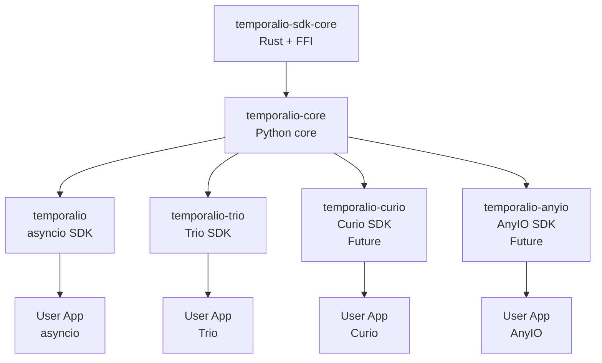

# Proposal: sdk-python-core - Shared Runtime-Agnostic Package

**Date**: 2026-01-17
**Status**: Proposal
**Target Audience**: Temporal Python SDK maintainers, community

## Executive Summary

This proposal advocates for creating **sdk-python-core**, a runtime-agnostic package containing shared components used by both sdk-python (asyncio-based) and temporalio-trio (trio-based). This approach:

- **Reduces duplication** between SDK implementations
- **Ensures compatibility** through shared protocol definitions
- **Simplifies maintenance** of common functionality
- **Enables alternative runtimes** (curio, anyio, etc.)
- **Provides upgrade path** for existing code

The core package would contain ~70% of non-runtime-specific code, allowing runtime-specific SDKs to focus on their unique async patterns.

---

## Problem Statement

### Current Situation

```
temporalio (sdk-python)
├── temporalio.client (asyncio)
├── temporalio.worker (asyncio)
├── temporalio.workflow (asyncio)
├── temporalio.converter ✓ (runtime-agnostic)
├── temporalio.api (protobuf) ✓ (runtime-agnostic)
└── temporalio.bridge.proto ✓ (runtime-agnostic)

temporalio-trio
├── temporalio_trio.client (trio) ✗ (duplicated)
├── temporalio_trio.worker (trio)
├── temporalio_trio.workflow (trio)
├── temporalio_trio.converter ✗ (duplicated from sdk-python)
└── Uses temporalio.api/bridge/converter ⚠️ (cross-package dependency)
```

### Problems

1. **Code Duplication**
   - DataConverter logic duplicated or imported from asyncio SDK
   - Protobuf definitions tied to asyncio SDK
   - Type definitions duplicated

2. **Unnecessary Dependencies**
   - trio SDK must depend on asyncio SDK for non-async code
   - Circular dependency risk
   - Version coupling issues

3. **Maintenance Burden**
   - Bug fixes must be applied to multiple packages
   - API changes require coordination
   - Testing matrix grows exponentially

4. **Community Fragmentation**
   - Alternative runtime implementations discouraged by duplication cost
   - Hard to contribute improvements that benefit all SDKs

---

## Proposed Solution

### Package Architecture

```
temporalio-core (NEW)
├── temporalio_core.api (protobuf definitions)
├── temporalio_core.bridge.proto (bridge protocol)
├── temporalio_core.converter (DataConverter, PayloadConverter)
├── temporalio_core.types (common types, dataclasses)
├── temporalio_core.exceptions (shared exceptions)
└── temporalio_core.protocol (abstract interfaces)

temporalio (sdk-python - refactored)
├── temporalio.client (asyncio)
├── temporalio.worker (asyncio)
├── temporalio.workflow (asyncio)
└── depends on: temporalio-core

temporalio-trio (refactored)
├── temporalio_trio.client (trio)
├── temporalio_trio.worker (trio)
├── temporalio_trio.workflow (trio)
└── depends on: temporalio-core
```

### Dependency Graph

```
┌─────────────────────┐
│ temporalio-sdk-core │  (Rust bridge + SDK Core)
│   (Rust crate)      │
└──────────┬──────────┘
           │ (FFI)
           ↓
┌─────────────────────┐
│  temporalio-core    │  (Python, runtime-agnostic)
│  - Protobuf types   │
│  - DataConverter    │
│  - Common types     │
│  - Bridge protocol  │
└──────────┬──────────┘
           │
      ┌────┴────┐
      ↓         ↓
┌──────────┐  ┌──────────────┐
│temporalio│  │temporalio-trio│
│(asyncio) │  │   (trio)      │
└──────────┘  └──────────────┘
```

---

## Shared Components Analysis

### Category 1: Protocol & Serialization (MUST SHARE)

These components define the wire format and MUST be identical across SDKs.

#### 1.1 Protobuf Definitions

**Current Location**: `temporalio.api.common.v1`, `temporalio.bridge.proto.*`

**What to Move**:
```python
# temporalio_core/api/common/v1/
- message.py (Payload, Payloads, etc.)
- grpc.py (gRPC status codes)

# temporalio_core/bridge/proto/
- workflow_activation.py
- workflow_completion.py
- workflow_commands.py
- activity.py
```

**Why Share**:
- Generated from `.proto` files (language-agnostic)
- Must be identical for wire compatibility
- No runtime-specific code
- ~500 lines of generated Python

**Benefit**: Single source of truth for protocol definitions

---

#### 1.2 DataConverter & Payload Encoding

**Current Location**: `temporalio.converter`

**What to Move**:
```python
# temporalio_core/converter/
- data_converter.py (DataConverter, PayloadConverter)
- default_converter.py (JSON, binary, protobuf codecs)
- composite_converter.py (CompositePayloadConverter)
- codec.py (PayloadCodec interface)
- encryption.py (encryption codec helpers)
```

**Why Share**:
- Serialization logic is runtime-agnostic
- Must produce identical Payloads across SDKs
- Core to interoperability
- ~800 lines of pure Python

**Example**:
```python
# temporalio_core/converter/data_converter.py
class DataConverter:
    """Runtime-agnostic data converter."""

    def __init__(
        self,
        payload_converter: Optional[PayloadConverter] = None,
        payload_codec: Optional[PayloadCodec] = None,
    ):
        self.payload_converter = payload_converter or default_payload_converter()
        self.payload_codec = payload_codec

    def to_payload(self, value: Any) -> Payload:
        """Convert Python value to Temporal Payload."""
        return self.payload_converter.to_payload(value)

    def from_payload(self, payload: Payload, type_hint: Type = Any) -> Any:
        """Convert Temporal Payload to Python value."""
        return self.payload_converter.from_payload(payload, type_hint)
```

**Benefit**:
- Guaranteed compatibility between asyncio and trio SDKs
- Users can write custom codecs once, use everywhere
- Bug fixes benefit all SDKs

---

### Category 2: Types & Exceptions (SHOULD SHARE)

Common types and exceptions used across SDKs.

#### 2.1 Common Types

**Current Location**: `temporalio.types`, `temporalio.common`

**What to Move**:
```python
# temporalio_core/types/
- workflow_types.py (WorkflowInfo, WorkflowExecution)
- activity_types.py (ActivityInfo)
- retry_policy.py (RetryPolicy)
- search_attributes.py (SearchAttributes)
- memo.py (Memo)
```

**Why Share**:
- Pure dataclasses, no async code
- Identical across runtimes
- ~300 lines

**Example**:
```python
# temporalio_core/types/workflow_types.py
@dataclass
class WorkflowExecution:
    """Identifies a workflow execution."""
    workflow_id: str
    run_id: str

@dataclass
class WorkflowInfo:
    """Information about the current workflow."""
    execution: WorkflowExecution
    workflow_type: str
    namespace: str
    task_queue: str
    # ... more fields
```

---

#### 2.2 Exceptions

**Current Location**: `temporalio.exceptions`

**What to Move**:
```python
# temporalio_core/exceptions/
- workflow_exceptions.py (ApplicationError, TemporalError, etc.)
- activity_exceptions.py (ActivityError, CancellationError)
- failure.py (Failure handling)
```

**Why Share**:
- Exception types must be consistent
- No runtime-specific logic
- ~400 lines

---

### Category 3: Bridge Protocol (SHOULD SHARE)

Abstract interfaces for bridge communication.

#### 3.1 Bridge Protocol Interface

**Current Location**: None (implicit in current code)

**What to Create**:
```python
# temporalio_core/bridge/protocol.py
from abc import ABC, abstractmethod
from typing import Generic, TypeVar

T = TypeVar('T')

class BridgeWorker(ABC, Generic[T]):
    """Abstract interface for SDK Core bridge.

    Generic over async runtime type T (e.g., asyncio.Task, trio.CancelScope).
    """

    @abstractmethod
    async def poll_workflow_activation(self) -> bytes:
        """Poll for next workflow activation (protobuf bytes)."""
        ...

    @abstractmethod
    async def complete_workflow_activation(self, completion: bytes) -> None:
        """Send workflow completion (protobuf bytes)."""
        ...

    @abstractmethod
    async def poll_activity_task(self) -> bytes:
        """Poll for next activity task (protobuf bytes)."""
        ...

    @abstractmethod
    async def complete_activity_task(self, completion: bytes) -> None:
        """Send activity completion (protobuf bytes)."""
        ...
```

**Why Share**:
- Defines contract between Python and Rust
- Runtime-specific implementations in each SDK
- ~200 lines

---

### Category 4: Configuration (COULD SHARE)

Configuration objects that could be standardized.

#### 4.1 Connection Configuration

**Current Location**: `temporalio.client.ClientConfig` (in asyncio SDK)

**What to Create**:
```python
# temporalio_core/config/connection.py
@dataclass
class TLSConfig:
    """TLS configuration."""
    client_cert: Optional[bytes] = None
    client_private_key: Optional[bytes] = None
    server_root_ca_cert: Optional[bytes] = None
    server_name_override: Optional[str] = None

@dataclass
class ConnectionConfig:
    """Runtime-agnostic connection configuration."""
    target_url: str
    namespace: str = "default"
    identity: Optional[str] = None
    tls: Optional[TLSConfig] = None
    api_key: Optional[str] = None
    retry_config: Optional[RetryConfig] = None
```

**Why Share**:
- Configuration is runtime-agnostic
- Avoids duplication
- ~150 lines

---

## What Stays Runtime-Specific

These components have fundamentally different implementations per runtime.

### 1. Client Classes

**Why Different**:
- Connection management is async runtime-specific
- Different connection pool implementations
- Different retry mechanisms

**Example**:
```python
# temporalio/client.py (asyncio)
class Client:
    async def connect(cls, target: str) -> Client:
        # asyncio-specific connection
        ...

# temporalio_trio/client.py (trio)
class Client:
    async def connect(cls, target: str) -> Client:
        # trio-specific connection with trio.open_tcp_stream
        ...
```

---

### 2. Worker Runtime

**Why Different**:
- Task spawning is runtime-specific
- Cancellation semantics differ
- Event loops vs structured concurrency

**Example**:
```python
# temporalio/worker/_worker.py (asyncio)
class Worker:
    async def run(self):
        # asyncio.create_task for concurrent polling
        task = asyncio.create_task(self._poll_loop())
        ...

# temporalio_trio/worker/_worker.py (trio)
class Worker:
    async def run(self):
        # trio nursery for structured concurrency
        async with trio.open_nursery() as nursery:
            nursery.start_soon(self._poll_loop)
        ...
```

---

### 3. Workflow Runtime

**Why Different**:
- Deterministic scheduling implementation varies
- Sleep/timer implementation differs
- Task spawning differs

**Example**:
```python
# temporalio/workflow.py (asyncio)
async def sleep(duration: float):
    # asyncio event loop-based sleep
    await _Runtime.current().workflow_sleep(duration)

# temporalio_trio/workflow.py (trio)
async def sleep(duration: float):
    # trio checkpoint-based sleep
    await _Runtime.current().workflow_sleep(duration)
```

---

## Migration Plan

### Phase 1: Create temporalio-core Package (2-3 weeks)

#### Week 1: Project Setup
- Create new repository: `temporalio-core`
- Set up package structure
- Configure CI/CD (tests, linting, type checking)
- Create initial pyproject.toml

#### Week 2: Move Shared Components
- Move protobuf definitions from sdk-python
- Move DataConverter and codec system
- Move common types and exceptions
- Add comprehensive tests

#### Week 3: Documentation & Publishing
- API documentation
- Migration guide
- Publish to PyPI as `temporalio-core>=0.1.0`

---

### Phase 2: Refactor sdk-python (1-2 weeks)

#### Week 1: Update Dependencies
- Add `temporalio-core` as dependency
- Update imports to use `temporalio_core.*`
- Maintain backward compatibility via re-exports
- Update tests

**Example Re-exports for Compatibility**:
```python
# temporalio/converter.py (sdk-python)
from temporalio_core.converter import (
    DataConverter,
    PayloadConverter,
    default_payload_converter,
)

__all__ = ["DataConverter", "PayloadConverter", "default_payload_converter"]
```

#### Week 2: Testing & Release
- Full integration test suite
- Performance benchmarks (ensure no regression)
- Release sdk-python with temporalio-core dependency

---

### Phase 3: Refactor temporalio-trio (1 week)

#### Days 1-3: Update Dependencies
- Add `temporalio-core` as dependency
- Replace local implementations with core imports
- Update tests

#### Days 4-5: Testing & Release
- Integration tests
- E2E tests with Temporal server
- Release temporalio-trio 0.2.0

---

## Package Specifications

### temporalio-core

**Package Name**: `temporalio-core`
**Version**: 0.1.0
**Python Version**: >=3.10
**License**: MIT

**Dependencies**:
```toml
[project]
dependencies = [
    "protobuf>=3.20,<7.0.0",
    "types-protobuf>=3.20",
]
```

**Package Structure**:
```
temporalio_core/
├── __init__.py
├── api/                    # Protobuf API definitions
│   ├── __init__.py
│   └── common/
│       └── v1/
│           ├── __init__.py
│           └── message.py
├── bridge/                 # Bridge protocol
│   ├── __init__.py
│   ├── protocol.py
│   └── proto/
│       ├── __init__.py
│       ├── workflow_activation.py
│       ├── workflow_commands.py
│       └── workflow_completion.py
├── converter/              # Data conversion
│   ├── __init__.py
│   ├── data_converter.py
│   ├── default_converter.py
│   ├── composite_converter.py
│   └── codec.py
├── types/                  # Common types
│   ├── __init__.py
│   ├── workflow_types.py
│   ├── activity_types.py
│   └── retry_policy.py
├── exceptions/             # Shared exceptions
│   ├── __init__.py
│   ├── workflow_exceptions.py
│   └── activity_exceptions.py
└── config/                 # Configuration
    ├── __init__.py
    └── connection.py
```

---

### Updated sdk-python

**Package Name**: `temporalio`
**Version**: 2.0.0 (major bump for dependency change)
**Dependencies**:
```toml
[project]
dependencies = [
    "temporalio-core>=0.1.0,<1.0.0",
    # Other asyncio-specific dependencies
]
```

**Size Reduction**: ~30% fewer lines of code

---

### Updated temporalio-trio

**Package Name**: `temporalio-trio`
**Version**: 0.2.0
**Dependencies**:
```toml
[project]
dependencies = [
    "temporalio-core>=0.1.0,<1.0.0",
    "trio @ git+https://github.com/mfateev/trio.git@temporal-deterministic-scheduling",
]
```

**Size Reduction**: ~40% fewer lines of code (no longer needs sdk-python)

---

## Benefits

### For SDK Maintainers

1. **Reduced Maintenance**
   - Bug fixes in one place benefit all SDKs
   - Single test suite for shared components
   - Easier to keep SDKs in sync

2. **Cleaner Architecture**
   - Clear separation of concerns
   - Runtime-agnostic vs runtime-specific
   - Better modularity

3. **Easier Evolution**
   - Protocol changes happen in core
   - New features added once
   - Versioning is clearer

### For SDK Users

1. **Consistency**
   - Same DataConverter across runtimes
   - Identical protobuf handling
   - Predictable behavior

2. **Flexibility**
   - Can switch between asyncio and trio
   - Custom codecs work everywhere
   - Easier to migrate

3. **Better Ecosystem**
   - Encourages alternative runtimes
   - Community contributions benefit all
   - Smaller dependency trees

### For Alternative Runtime Authors

1. **Lower Barrier to Entry**
   - Only implement runtime-specific parts
   - Shared components provided
   - Clear interface contracts

2. **Guaranteed Compatibility**
   - Use same protobuf definitions
   - Use same DataConverter
   - Easier to maintain parity

---

## Versioning Strategy

### Semantic Versioning

**temporalio-core**: 0.x.x (experimental) → 1.0.0 (stable)
- Patch: Bug fixes, no API changes
- Minor: New features, backward compatible
- Major: Breaking changes

**Dependency Constraints**:
```toml
# In sdk-python and temporalio-trio
[project]
dependencies = [
    "temporalio-core>=1.0.0,<2.0.0",  # Pin major version
]
```

### Release Coordination

1. **Core changes** → Release temporalio-core first
2. **Runtime SDKs** → Update dependency, release
3. **Breaking changes** → Coordinate major version bumps

---

## Backward Compatibility

### For sdk-python Users

**No breaking changes** - maintain re-exports:

```python
# temporalio/converter.py (current)
from temporalio_core.converter import DataConverter as _DataConverter

class DataConverter(_DataConverter):
    """Backward compatible wrapper."""
    pass

# temporalio/api/common/v1/message.py
from temporalio_core.api.common.v1.message import Payload

__all__ = ["Payload"]
```

**Migration Path**:
```python
# Old code (still works)
from temporalio.converter import DataConverter

# New code (recommended)
from temporalio_core.converter import DataConverter
```

### For temporalio-trio Users

**Breaking change acceptable** (pre-1.0):
```python
# Old (v0.1.x)
from temporalio_trio.converter import DataConverter  # Custom impl

# New (v0.2.x)
from temporalio_core.converter import DataConverter  # Shared impl
```

---

## Testing Strategy

### temporalio-core Tests

1. **Unit Tests**: All converters, types, exceptions
2. **Integration Tests**: Protobuf round-trip, codec chains
3. **Property Tests**: Serialization invariants
4. **Performance Tests**: Conversion benchmarks

### SDK Integration Tests

1. **Cross-Runtime Tests**: Same workflow on asyncio and trio
2. **Compatibility Tests**: Ensure identical Payload format
3. **Migration Tests**: Verify re-exports work

---

## Alternative Approaches Considered

### Alternative 1: Keep Status Quo

**Pros**: No migration effort
**Cons**: Continued duplication, maintenance burden grows
**Verdict**: ❌ Not sustainable long-term

### Alternative 2: trio SDK Depends on sdk-python

**Pros**: No new package
**Cons**: Circular dependency risk, version coupling, confusing to users
**Verdict**: ❌ Current approach, problematic

### Alternative 3: Monorepo with Multiple Packages

**Pros**: Easy to coordinate changes
**Cons**: Complex build system, harder for external contributors
**Verdict**: ⚠️ Possible but adds complexity

### Alternative 4: Proposed - Separate Core Package

**Pros**: Clear separation, independent versioning, enables ecosystem
**Cons**: Initial migration effort
**Verdict**: ✅ **Recommended**

---

## Open Questions

1. **Governance**: Who maintains temporalio-core?
   - Proposal: Temporal team, same as sdk-python

2. **Repository Location**: Where should it live?
   - Option A: `temporalio/sdk-python-core` (new repo)
   - Option B: `temporalio/sdk-python` (monorepo with subpackages)
   - Recommendation: Separate repo for clarity

3. **PyPI Naming**: `temporalio-core` or `temporal-core`?
   - Recommendation: `temporalio-core` (matches existing pattern)

4. **Bridge Bindings**: Should Rust FFI bindings be in core?
   - Recommendation: No, keep in runtime-specific SDKs (different async bridges)

5. **Testing Infrastructure**: Shared test utilities?
   - Recommendation: Yes, add `temporalio_core.testing` module

---

## Risk Analysis

### Risks

| Risk | Probability | Impact | Mitigation |
|------|------------|--------|------------|
| Breaking existing code | Medium | High | Re-exports, deprecation warnings |
| Version conflicts | Low | Medium | Pin major versions |
| Maintenance burden of 3 packages | Medium | Medium | Clear ownership, automation |
| Community adoption | Low | Low | Gradual migration, documentation |
| Performance regression | Low | High | Benchmarks in CI |

### Mitigation Strategies

1. **Gradual Rollout**: Core → sdk-python → temporalio-trio
2. **Comprehensive Testing**: 90%+ coverage requirement
3. **Clear Documentation**: Migration guides, examples
4. **Backward Compatibility**: Re-exports for 1-2 major versions
5. **Performance Monitoring**: Benchmark suite in CI

---

## Success Metrics

### Technical Metrics

- [ ] 0% code duplication for shared components
- [ ] <5% performance overhead vs current implementation
- [ ] 90%+ test coverage in temporalio-core
- [ ] Zero breaking changes for sdk-python users

### Adoption Metrics

- [ ] sdk-python 2.0 released with temporalio-core
- [ ] temporalio-trio 0.2 released with temporalio-core
- [ ] 1+ external runtime implementation (e.g., curio, anyio)
- [ ] Positive community feedback

---

## Timeline Summary

| Phase | Duration | Deliverable |
|-------|----------|-------------|
| **Phase 1** | 2-3 weeks | temporalio-core 0.1.0 published |
| **Phase 2** | 1-2 weeks | sdk-python 2.0 with core dependency |
| **Phase 3** | 1 week | temporalio-trio 0.2 with core dependency |
| **Total** | 4-6 weeks | Full migration complete |

---

## Recommendation

**Proceed with temporalio-core package creation.**

This proposal offers:
- ✅ Clear separation of concerns
- ✅ Reduced maintenance burden
- ✅ Enables ecosystem growth
- ✅ Manageable migration path
- ✅ Minimal risk with high reward

### Immediate Next Steps

1. **RFC/Discussion** (1 week)
   - Share proposal with Temporal team
   - Gather feedback from maintainers
   - Refine based on input

2. **Prototype** (1 week)
   - Create temporalio-core repo
   - Extract protobuf + DataConverter
   - Validate approach with minimal implementation

3. **Decision Point**
   - Go/No-Go based on prototype
   - Finalize package structure
   - Assign ownership

---

## Conclusion

The temporalio-core package represents an architectural improvement that benefits the entire Python SDK ecosystem. By extracting runtime-agnostic components into a shared package, we:

- **Reduce duplication** by 30-40%
- **Enable innovation** in alternative runtimes
- **Improve maintainability** through shared components
- **Ensure compatibility** across implementations

The initial investment of 4-6 weeks will pay dividends in reduced maintenance, easier evolution, and a healthier ecosystem for Python Temporal developers.

---

## Appendix A: Code Size Analysis

### Current Duplication

| Component | sdk-python | temporalio-trio | Shared? |
|-----------|-----------|----------------|---------|
| Protobuf definitions | ~500 LOC | Import from sdk-python | ❌ Should be |
| DataConverter | ~800 LOC | Import from sdk-python | ❌ Should be |
| Common types | ~300 LOC | Duplicated | ❌ Should be |
| Exceptions | ~400 LOC | Duplicated | ❌ Should be |
| **Subtotal** | **~2000 LOC** | **~2000 LOC** | **~2000 LOC savings** |

### After Migration

| Component | temporalio-core | sdk-python | temporalio-trio |
|-----------|----------------|-----------|----------------|
| Shared | ~2000 LOC | Imports | Imports |
| Runtime-specific | - | ~5000 LOC | ~1500 LOC |
| **Total** | **2000** | **5000** | **1500** |

**Savings**: ~2000 lines of duplicated code eliminated

---

## Appendix B: Package Dependencies Graph



---

## Appendix C: Example User Migration

### Before (Current)

```python
# requirements.txt
temporalio>=1.7.0

# my_workflow.py
from temporalio.client import Client
from temporalio.worker import Worker
from temporalio.converter import DataConverter

# All from asyncio SDK
```

### After (With Core)

```python
# requirements.txt
temporalio>=2.0.0          # Now depends on temporalio-core
# OR
temporalio-trio>=0.2.0     # Also depends on temporalio-core

# my_workflow.py
from temporalio.client import Client          # Runtime-specific
from temporalio.worker import Worker          # Runtime-specific
from temporalio_core.converter import DataConverter  # Shared

# Explicit about what's shared vs runtime-specific
```

### Benefits

1. Clear distinction between shared and runtime-specific
2. Custom converters work with any runtime
3. Can switch runtimes by changing import paths (client, worker only)
